<!-- Header Section -->

  

  

  
  

  
  
  
  
  

 

<h3 align="center">💡 AI Engineer & Serial Founder | Building Scalable, Intelligent Systems</h3>

  Passionate about turning cutting-edge research into high-impact, production-ready AI products. 
  Proven track record in scaling platforms, leading technical teams, and rapid MVP development.

<table border="0" width="100%">
  <tr>
    <td align="center">🚀 <b>2 Successful Exits</b> (Wisdomic AI '25, GetGroceryBD '23)</td>
    <td align="center">🏆 <b>National AI Olympiad 2025</b> Winner</td>
    <td align="center">🤖 Architected scalable <b>AI Agents & Systems</b></td>
  </tr>
</table>

 

<h2 align="center" style="color:#00d084;"> 🌟 Featured Projects </h2>

<table border="0" width="100%">
  <tr>
    <td width="25%" align="center" style="color:#00d084;"><strong>Project</strong></td>
    <td width="40%" align="center" style="color:#00d084;"><strong>Impact & Description</strong></td>
    <td width="35%" align="center" style="color:#00d084;"><strong>Tech Stack & Infra</strong></td>
  </tr>
  <tr>
    <td align="left" style="color:#00d084;">🧠 <a href="https://www.ovishekh.com/notes/wisdomic-demo">Wisdomic AI</a>  [Acquired'25]</td>
    <td align="left">AI research agent for literature review and academic analysis. Successfully scaled and acquired.</td>
    <td align="left">React, Node.js, FastAPI, DeepSeek • <strong>GCP</strong></td>
  </tr>
  <tr>
    <td align="left" style="color:#00d084;">☪️ <a href="https://imam.ovishekh.com/">Imam AI</a>  [Awarded'26]</td>
    <td align="left">Advanced Islamic AI agent with verification capabilities across social media content.</td>
    <td align="left">Next.js, Python, PostgreSQL, Claude API • <strong>Vercel</strong></td>
  </tr>
  <tr>
    <td align="left" style="color:#00d084;">🎯 <a href="https://cp.ovishekh.com/">JobwiseLM</a>  [Thesis'26]</td>
    <td align="left">AI-powered career platform handling resume optimization and intelligent job matching.</td>
    <td align="left">Next.js, Node.js, PostgreSQL, Redis • <strong>Vercel</strong></td>
  </tr>
  <tr>
    <td align="left" style="color:#00d084;">✨ <a href="https://tawheed.ovishekh.com/">Tawheed AI</a></td>
    <td align="left">Content authenticity verification system cross-referencing Quranic sources at scale.</td>
    <td align="left">Next.js, FastAPI, Claude API • <strong>Cloudflare, Digital Ocean</strong></td>
  </tr>
  <tr>
    <td align="left" style="color:#00d084;">💰 <a href="https://cryptell.com/">Cryptell</a></td>
    <td align="left">Fully decentralized crypto exchange with real-time trading and secure wallet integration.</td>
    <td align="left">Next.js, Node.js, Web3.js • <strong>AWS</strong></td>
  </tr>
  <tr>
    <td align="left" style="color:#00d084;">📈 <a href="https://www.ovishekh.com/work/super-trader-ai">Super Trader</a></td>
    <td align="left">High-frequency AI crypto arbitrage platform executing profitable real-time opportunities.</td>
    <td align="left">Next.js, Node.js, WebSocket APIs • <strong>Hostinger VPS</strong></td>
  </tr>

</table>

 

<h2 align="center" style="color:#00d084;"> 💼 Professional Value & Leadership </h2>

- 🚀 **Proven Entrepreneurship**: Co-founded [Arklab AI](https://www.arklabai.com/) and drove 2 startups from inception to successful acquisition.
- 💡 **Technical Architecture**: Designing resilient, highly-available backend systems and microservices across AWS and GCP.
- 🤖 **Applied AI & LLMs**: Deep expertise in integrating foundational models, fine-tuning, RAG architectures, and agentic workflows.
- ⚡ **Rapid Execution**: Consistently turning zero-to-one product ideas into validated, scalable MVPs.
- 🤝 **Community Leadership**: Collaborated with [Mozilla](https://www.mozilla.org/) and [IEEE](https://github.com/IEEE-DIU-SB). Strong advocate for mentorship and technical communication.
- 🎓 **Education**: B.Sc. in Computer Science & Engineering, [Daffodil International University](https://www.daffodilvarsity.edu.bd/).

 

<h2 align="center" style="color:#00d084;"> 📦 Technical Arsenal </h2>

| **Category**               | **Technologies**                                                                                                                                                                                                                                                                                                                                                                                                                                                                                                                                                                                                                                                                                                                                                                                                                                                                                                                                                                                                                                                                                                                                                                                                                                           |
| -------------------------- | ---------------------------------------------------------------------------------------------------------------------------------------------------------------------------------------------------------------------------------------------------------------------------------------------------------------------------------------------------------------------------------------------------------------------------------------------------------------------------------------------------------------------------------------------------------------------------------------------------------------------------------------------------------------------------------------------------------------------------------------------------------------------------------------------------------------------------------------------------------------------------------------------------------------------------------------------------------------------------------------------------------------------------------------------------------------------------------------------------------------------------------------------------------------------------------------------------------------------------------------------------------- |
| **Languages**              |                                                                                                                                                                                                                                                                                                                                                                                                                                                         |
| **Cloud & Infra**          |                                                                                                                                                                                                                                                                                                                                                                                                                                                                                                                                                                       |
| **Databases**              |                                                                                                                                                                                                                                                                                                                                                                                                                                                                                                                                                                                                                                                                                                      |
| **Frameworks**             |                                                                                                                                                                                                                                                                                                                                                                                                                                                                                          |
| **AI / ML**                |                                                                                                                                                                                                                                                                                                                                                                                                                                       |

 

<h2 align="center" style="color:#00d084;"> 💻 Featured Open Source </h2>

  
  
  
  
  
  

  
<b>Show More Projects & Academic Courses ⬇️</b>

   
  

    
    
    
    
    
    
    
    
    
  

  <h3 align="center" style="color:#00d084;">🎓 Academic Courses</h3>
  

    
    
    
    
    
    
    
    
    
    
    
    
  

 

## 📊 Analytics & Activity

<table border="0" width="100%">
  <tr>
    <td width="50%" align="center">
      
    </td>
    <td width="50%" align="center">
      
    </td>
  </tr>
</table>

  

  

 

## 🏆 Achievements

  

  <h3>Let's Build Something Great 🚀</h3>
  
Always open to discussing cutting-edge AI integrations, scaling systems, or new startup ventures.

  
  
  
  

 

  

